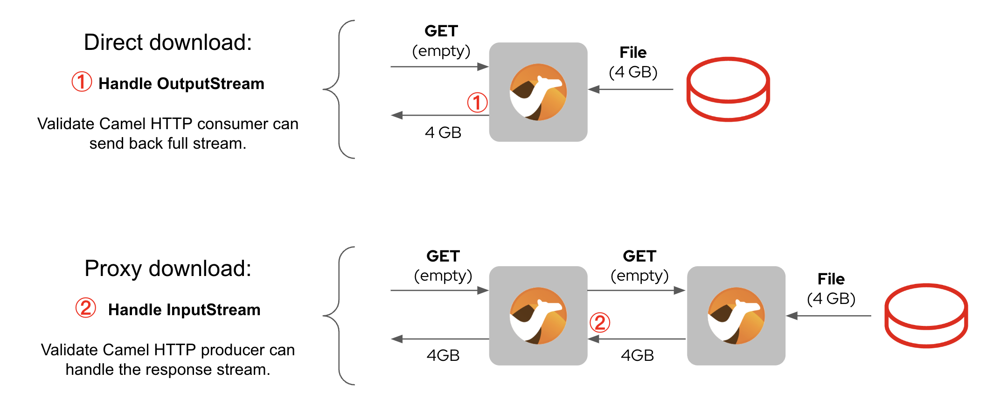
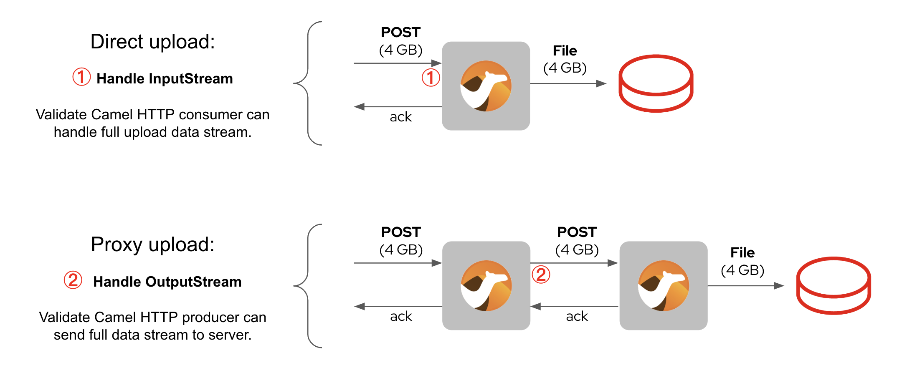

== Camel Spring Boot Example: HTTP Large File Streaming

=== Introduction

This project contains logic to handle large HTTP data streams in download, upload, and proxy scenarios. The aim is to show Camel's ability to process streams without exhausting JVM memory.

=== Use cases

[NOTE]
====
Streaming mode opens up many interesting use cases, for example, data transformation on very large data structures, applying selective/discarding rules, split/merging of data, multiplexing data streams, and others.
====

This example only covers the basics of enabling streaming mode. The two implemented scenarios using Camel in streaming mode are:

- HTTP data downloads
- HTTP data uploads

Camel may act as the end system responsible to locally/remotely store the data stream. Or it may also act as a proxy system, passing the responsibility downstream.

The critical data handling happens in the numbered 1) and 2) positions illustrated below.

=== Download scenario

=== Upload scenario

=== How to run

To demonstrate Camel can handle larger data streams than memory allocated to the JVM, we need to start it with low memory settings.

To run it follow the commands below:

Follow these steps to run the example:

1. Decide which scenario you want to run: `download` or `upload`.

2. Navigate to the corresponding folder and run both the backend and proxy servers with low memory settings (make sure ports 8080 and 9000 are available):

    mvn spring-boot:run -Dspring-boot.run.jvmArguments="-Xms200m -Xmx200m"

3. From the `client` directory, send a request using a large data stream.
(See detailed instructions in `client/Readme.adoc`.)

4. Stop Camel Spring Boot and inspect the result file.

  Camel Spring Boot should process the HTTP byte stream and dump it in a file in the 'client' directory.

=== Help and contributions

If you hit any problem using Camel or have some feedback, then please
https://camel.apache.org/community/support/[let us know].

We also love contributors, so
https://camel.apache.org/community/contributing/[get involved] :-)

The Camel riders!
