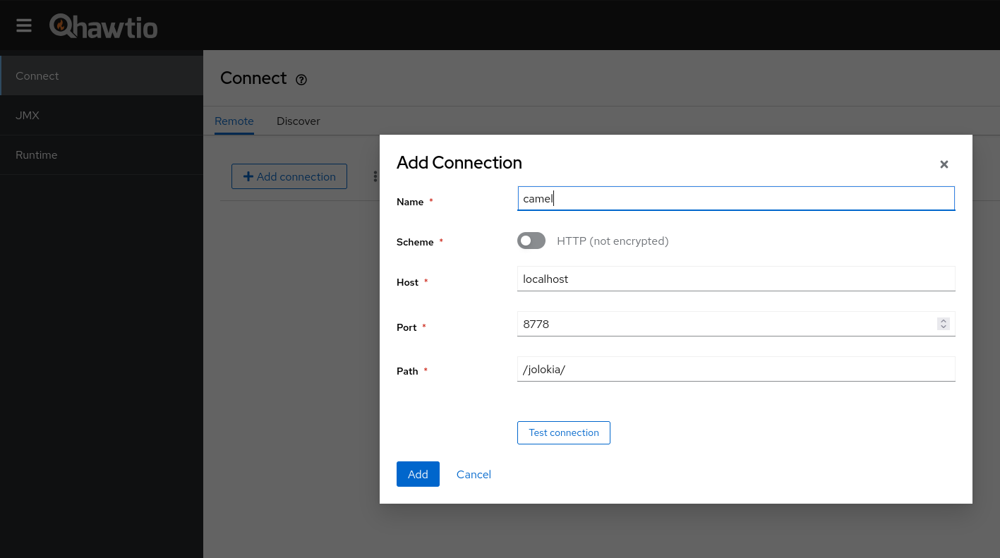
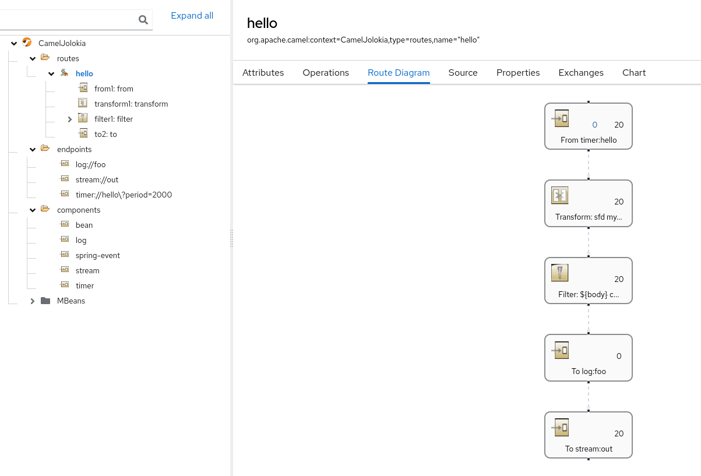

== Jolokia Example

This example shows how Camel can be monitored and managed using https://jolokia.org[Jolokia] and https://hawt.io[Hawtio]

=== How to run

You can run this example using

    mvn spring-boot:run

=== Run Hawtio

Hawtio is a lightweight and modular Web console for managing Java applications.
It can be installed/used in more ways, see https://hawt.io/docs/get-started.html[Get Started Guide]

In the example I am suggesting the jbang way to install it

    jbang app install hawtio@hawtio/hawtio
    hawtio --port 8090

=== Connect to the application

Open Hawtio UI at http://localhost:8090/hawtio/connect/remote[] and click on `Add connection` button filling the properties as in the picture

- Name: `as you prefer [eg camel]`
- Scheme: `http`
- Host: `localhost`
- Port: `8778`
- Path: `/jolokia/`

click on `Add` button, this action will create a connection in the list of the connections,
then connect on it clicking on the button `Connect`

then it is possible to monitor and to manage routes

=== Configure Jolokia endpoint

The Jolokia autoconfiguration is an alternative to the Jolokia agent,
more information about the usage and the configuration can be found on https://github.com/apache/camel-spring-boot/blob/main/components-starter/camel-jolokia-starter/src/main/docs/jolokia.adoc[component guide]

=== Help and contributions

If you hit any problem using Camel or have some feedback, then please
https://camel.apache.org/community/support/[let us know].

We also love contributors, so
https://camel.apache.org/community/contributing/[get involved] :-)

The Camel riders!
