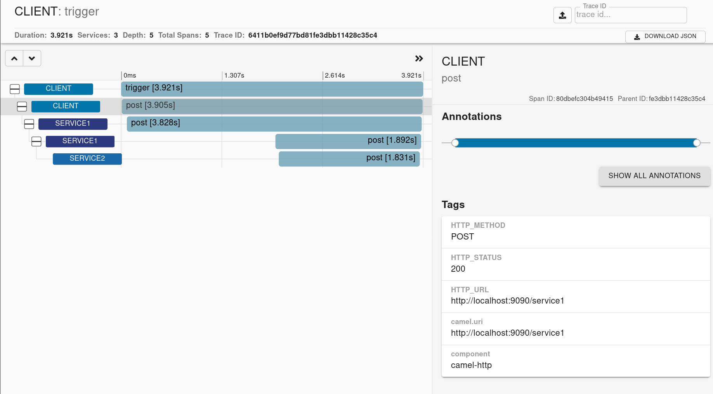

== Micrometer Observation Example

=== Introduction

This example shows how to use Camel with Micrometer Observation to create observations for
incoming and outgoing Camel messages.

For Metrics we are using Micrometer Core, for Tracing we're using Micrometer Tracing with Brave.

The example includes four sub maven modules that implement

* client
* service1
* service2
* loggingtracer

Where client -> service1 -> service2 using HTTP.

=== Build

You will need to compile this example first:

[source,sh]
----
$ mvn compile
----

=== Run the example

Then using three different shells and run service1 and service2 before
the client. These services use an annotation _CamelObservation_ to
indicate that the service should be traced.

[source,sh]
----
$ cd service1
$ mvn compile spring-boot:run
----

When service1 is ready then start service2

[source,sh]
----
$ cd service2
$ mvn compile spring-boot:run
----

And then start the client that calls service1 every 30 seconds.

[source,sh]
----
$ cd client
$ mvn compile spring-boot:run
----

The client application explicitly instantiates and initializes the
Micrometer Observation Tracer with the _CamelContext_.

The shells will show _SPAN FINISHED_ messages indicating what spans have
been reported from the client and two services.

=== Outcome

You should get a trace view similar to this one

You will get Camel related metrics similar to these

Example for server application

[source]
-----
Meter name [POST], type [TIMER] - measurements [Measurement{statistic='COUNT', value=1.0}, Measurement{statistic='TOTAL_TIME', value=3.078740245}, Measurement{statistic='MAX', value=3.078740245}]
Meter name [POST.active], type [LONG_TASK_TIMER] - measurements [Measurement{statistic='ACTIVE_TASKS', value=0.0}, Measurement{statistic='DURATION', value=0.0}]
Meter name [camel.component], type [TIMER] - measurements [Measurement{statistic='COUNT', value=1.0}, Measurement{statistic='TOTAL_TIME', value=1.321830243}, Measurement{statistic='MAX', value=1.321830243}]
Meter name [camel.component.active], type [LONG_TASK_TIMER] - measurements [Measurement{statistic='ACTIVE_TASKS', value=0.0}, Measurement{statistic='DURATION', value=0.0}]
-----

Example for client application

[source]
-----
Meter name [trigger], type [TIMER] - measurements [Measurement{statistic='COUNT', value=1.0}, Measurement{statistic='TOTAL_TIME', value=3.168954513}, Measurement{statistic='MAX', value=3.168954513}]
Meter name [trigger.active], type [LONG_TASK_TIMER] - measurements [Measurement{statistic='ACTIVE_TASKS', value=0.0}, Measurement{statistic='DURATION', value=0.0}]
Meter name [camel.component], type [TIMER] - measurements [Measurement{statistic='COUNT', value=1.0}, Measurement{statistic='TOTAL_TIME', value=3.154452898}, Measurement{statistic='MAX', value=3.154452898}]
Meter name [camel.component.active], type [LONG_TASK_TIMER] - measurements [Measurement{statistic='ACTIVE_TASKS', value=0.0}, Measurement{statistic='DURATION', value=0.0}]
-----

=== Help and contributions

If you hit any problem using Camel or have some feedback, then please
https://camel.apache.org/community/support/[let us know].

We also love contributors, so
https://camel.apache.org/community/contributing/[get involved] :-)

The Camel riders!
