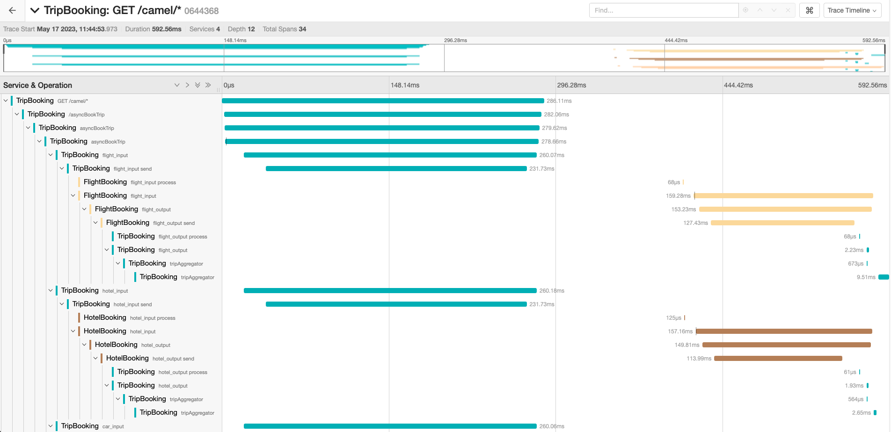

== OpenTelemetry example

== Introduction

This example shows how to use Camel with OpenTelemetry standard:
image:./adoc/img/example.jpeg?raw=true[example]

The environment is the following:

* Demo apps:
** link:TripBooking[Trip booking app]
** link:FlightBooking[Flight booking app]
** link:HotelBooking[Hotel booking app]
** link:CarBooking[Car booking app]
* OpenTelemetry Collector
* Jaeger
* Prometheus
* Apache Kafka _(for async communication between apps cases)_

=== Build

You will need to compile this example first:

[source,sh]
----
mvn compile
----

All the following docker-compose commands should be run from this directory.

=== Run the example

You may want to remove any old containers to start cleaning:

[source,sh]
----
docker rm -f kafka zookeeper prometheus jaeger otel-collector
----

We suggest using multiple terminal windows to start the following components:

* Infrastructure components
* Demo apps
** TripBooking
** FlightBooking
** HotelBooking
** CarBooking
* Testing for sending HTTP requests

==== Startup infrastructure components

[source,sh]
----
docker-compose -f containers/docker-compose.yml up
----

==== Startup demo apps
Please use four different shells for each application:

===== CarBooking
[source,sh]
----
mvn clean spring-boot:run -f CarBooking/pom.xml
----

===== HotelBooking
[source,sh]
----
mvn clean spring-boot:run -f HotelBooking/pom.xml
----

===== FlightBooking
[source,sh]
----
mvn clean spring-boot:run -f FlightBooking/pom.xml
----

===== TripBooking
[source,sh]
----
mvn clean spring-boot:run -f TripBooking/pom.xml
----

==== Testing

You can use any HTTP client (web browser, curl, httpie, postman etc.) for testing purposes.

===== cURL

Sync communication (over HTTP):

[source,sh]
----
curl http://127.0.0.1:8080/camel/bookTrip
----

Async communication (over Kafka):

[source,sh]
----
curl http://127.0.0.1:8080/camel/asyncBookTrip
----

==== Links

* Prometheus UI: http://localhost:9090/graph
* Jaeger UI: http://localhost:16686

=== Outcome
==== Tracing
===== Sync case
You should get a trace view similar to this one:

DAG is the following:

===== Async case
You should get a trace view similar to this one:

DAG is the following:

==== Metrics

You will get Camel-related metrics similar to these:

==== Logging

MDC Logging is enabled, and tracing information printing into the logs to be able to find corresponding trace logs entries. For example:

[source,sh]
----
...
11:52:18.923 INFO  [d02a363f16e88d9f012a36563b5464f5,9a328d33319645ab] bookTrip-http - New book trip request with trace=00-d02a363f16e88d9f012a36563b5464f5-9570717e10d38afa-01
11:52:18.931 INFO  [d02a363f16e88d9f012a36563b5464f5,9a328d33319645ab] bookTrip-http - Response: [{"bookingId":82,"car":"Volkswagen Jetta","startDate":"12-11-2018","endDate":"15-11-2018","price":152}, {"bookingId":907,"flight":"China Eastern Airlines 2782","startDate":"12-11-2018","endDate":"15-11-2018","price":133}, {"bookingId":926,"hotel":"Sheraton","startDate":"12-11-2018","endDate":"15-11-2018","price":200}]
...
----

=== Help and contributions

If you hit any problem using Camel or have some feedback, then please
https://camel.apache.org/community/support/[let us know].

We also love contributors, so
https://camel.apache.org/community/contributing/[get involved] :-)

The Camel riders!