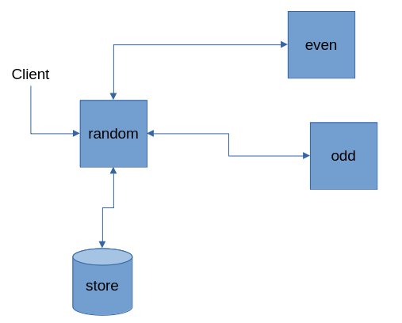
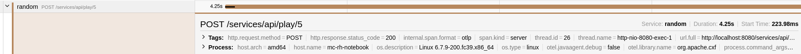

== Spring Boot Example with Camel exposing REST services using Apache CXF, collecting distributed tracing using OpenTelemetry

=== Introduction

This example illustrates how to use https://projects.spring.io/spring-boot/[Spring Boot] with http://camel.apache.org[Camel] and https://cxf.apache.org/[Apache CXF] implementing REST services using bottom-up approach.

If you are using REST services directly from Camel and you want to use https://opentelemetry.io/[OpenTelemetry] please refer to link:../opentelemetry/README.adoc[the dedicated example]

There are 3 services which communicate each other, starting from the `random` service:

- random: the main service, exposes the entry point REST service and store the results
- even: the service that verifies the even numbers
- odd: the service that verifies the odd numbers

moreover there is a common module containing common classes

=== Build

You can build this example using the following command; it will also download the OpenTelemetry agent used to instrument the applications:

    $ mvn package -Potel-agent

=== Run

Run docker-compose to start all the needed services:

    $ docker-compose -f containers/docker-compose.yml up -d

the command runs:

- https://github.com/minio/minio[minio] as application storage
- https://github.com/open-telemetry/opentelemetry-collector[opentelemetry-collector] to receive the generated Trace/Span
- https://github.com/jaegertracing/jaeger[Jaeger] to visualize the traces

Run each services on separated terminals:

    $ source containers/env.sh \
        && java -javaagent:target/opentelemetry-javaagent.jar \
        -Dotel.service.name=random \
        -jar rest-cxf-otel-random/target/*.jar

    $ source containers/env.sh \
        && java -javaagent:target/opentelemetry-javaagent.jar \
        -Dotel.service.name=even \
        -Dserver.port=8081 \
        -jar rest-cxf-otel-even/target/*.jar

    $ source containers/env.sh \
        && java -javaagent:target/opentelemetry-javaagent.jar \
        -Dotel.service.name=odd \
        -Dserver.port=8082 \
        -jar rest-cxf-otel-odd/target/*.jar

After the Spring Boot applications have been started, you can open the following URL in your web browser http://localhost:8080/services/ to access the list of services,  including WADL definition

You can also access the REST endpoint from the command line:

i.e. to generate 5 random numbers run:

    $ curl -X POST http://localhost:8080/services/api/play/5 -s | jq .

The command will produce an output like:

[source,json]
----
{
  "result": {
    "ODD": [
      {
        "number": 229,
        "type": "ODD"
      },
      {
        "number": 585,
        "type": "ODD"
      }
    ],
    "EVEN": [
      {
        "number": 648,
        "type": "EVEN"
      },
      {
        "number": 670,
        "type": "EVEN"
      },
      {
        "number": 846,
        "type": "EVEN"
      }
    ]
  },
  "evenCount": 3,
  "oddCount": 2
}
----

Now in the Jaeger UI http://localhost:16686 the traces will be available, both from Camel and from CXF instrumentation

The services can be stopped pressing `[CTRL] + [C]` in the shell, and the containers can be stopped with

    $ docker-compose -f containers/docker-compose.yml down

=== Explain the code

The dependency `org.apache.cxf:cxf-integration-tracing-opentelemetry` provides `org.apache.cxf.tracing.opentelemetry.jaxrs.OpenTelemetryFeature` that instruments the OpenTelemetry API implemented in the java agent.

The feature is injected in the Spring context

[source,java]
----
include::rest-cxf-otel-common/src/main/java/org/apache/camel/example/springboot/cxf/otel/CxfConfig.java[lines=35..38]
----

and then it is configured in the Camel route as provider in the `cxfrs` endpoint

[source,java]
----
include::rest-cxf-otel-random/src/main/java/org/apache/camel/example/springboot/cxf/otel/CamelRouter.java[lines=51]
----

When the feature is enabled it is possible to add custom tags or logs using `TracerContext` from CXF
[source,java]
----
include::rest-cxf-otel-random/src/main/java/org/apache/camel/example/springboot/cxf/otel/RandomService.java[lines=56..58]
----

[source,java]
----
include::rest-cxf-otel-random/src/main/java/org/apache/camel/example/springboot/cxf/otel/RandomServiceImpl.java[lines=43..45]
----

=== Help and contributions

If you hit any problem using Camel or have some feedback, then please
https://camel.apache.org/community/support/[let us know].

We also love contributors, so
https://camel.apache.org/community/contributing/[get involved] :-)

The Camel riders!
