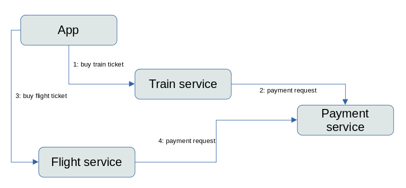
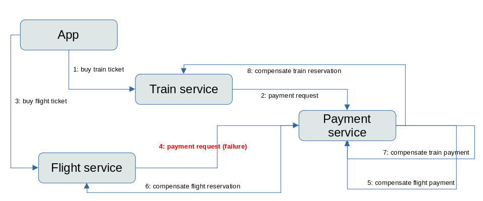
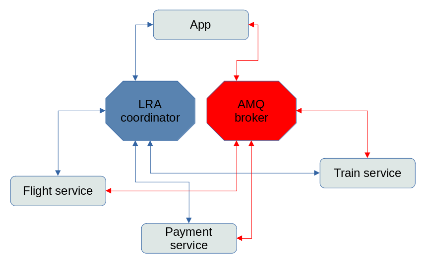

== Spring Boot and SAGA EIP Example

This example shows how to work with Apache Camel Saga using Spring Boot and Narayana LRA Coordinator to manage long running actions

=== How it works

There are 4 services as participants of the Saga:

- payment-service: it emulates a real payment transaction and it will be used by both flight-service and train-service
- flight-service: it emulates the booking of a flight ticket and it uses the payment-service to execute a payment transaction
- train-service: it emulates the reservation of a train seat and it uses the payment-service to execute a payment transaction
- app: is the starting point and it emulates a user that starts the transaction to buy both flight and train tickets

The starting point is a REST endpoint that creates a request for a new reservation
and there is 15% probability that the payment service fails.

==== Logical view

==== Compensating a failure

==== Technical view

The communication between services and LRA coordinator (blue connectors) is via HTTP protocol,
so every service expose REST endpoints called by the LRA, moreover it calls LRA via REST endpoint

The communication between services (red connectors) is via AMQ broker (using OPENWIRE protocol),
implemented using Camel JMS component and RequestReply EIP
obtaining a synchronous behavior using asynchronous protocol

==== Analyzing logs

In the logs there will be all the messages about the execution of the service.

First the app starts the saga LRA, passing the id to the entry point REST

[source,shell]
----
#local environment
curl -X POST http://localhost:8084/api/saga?id=1

#Openshift cluster
curl -X POST "http://$(oc get route camel-example-spring-boot-saga-app -o go-template --template='{{.spec.host}}')/api/saga?id=1"
----

in the log

[source]
----
Executing saga #1 with LRA http://localhost:8080/lra-coordinator/0_ffff7f000001_8aad_62d16f11_2
----

where the URL contains the id of the LRA and the number of the saga is the value of the parameter passed to the rest in the starting point

We're expecting that if the payment is ok, the message in the payment service will be:

[source]
----
Paying train for order #1

Payment train done for order #1 with payment transaction xxxxx

Payment flight done for order #1 with payment transaction xxxxx
----

the value of the payment transaction is the `JMSCorrelationID` used in the RequestReply EIP in the payment service

If the random failure occurs, the log in the payment service will be

[source]
----
Payment flight for saga #65 fails!

Payment for order #65 has been cancelled
----

It means that the compensation for the payment has been called, so we expect that in the flight service there will be a log

[source]
----
Flight purchase #65 has been cancelled due to payment failure
----

in the train service

[source]
----
Train purchase #65 has been cancelled due to payment failure
----

in the app

[source]
----
Transaction http://localhost:8080/lra-coordinator/0_ffff7f000001_8aad_62d16f11_74 has been cancelled due to flight or train failure
----

=== Running on Openshift cluster

==== Requirements

 - `oc` client installed (https://docs.openshift.com/container-platform/latest/cli_reference/openshift_cli/getting-started-cli.html[guide])
 - already logged in into cluster (running `oc login`)
 - destination project already created (running `oc new-project my-project`)

==== Run installation script

[source,shell]
----
# if the cluster is enabled to create Persistent Volume Claims
./install-ocp.sh

# otherwise in ephemeral mode
./install-ocp-ephemeral.sh
----

===== Red Hat Developer Sandbox usage example

Go to https://developers.redhat.com/developer-sandbox/get-started after login, click on `Start using your sandbox` button.

Then login into the Openshift and copy the command login clicking on the link `Copy Login Command` in the OpenShift console (the command will be something similar to `oc login --token=sha256~xxxx --server=https://api.sandbox-xxxx.openshiftapps.com:6443`).

Select your project `oc project xxxxxx-dev`

Run that command on the terminal and then run the installation script `./install-ocp-ephemeral.sh`

===== Check OCP generated resources

it will generate all the necessary PODs:

 - amq-broker
 - lra-coordinator
 - camel-example-spring-boot-saga-app
 - camel-example-spring-boot-saga-flight
 - camel-example-spring-boot-saga-payment
 - camel-example-spring-boot-saga-train

wait for all the pods to be ready:

[source,shell]
----
# all running pods
oc get pods -l csbexample=saga

# only services
oc get pods -l csbexample=saga -l provider=jkube
----

tail logs of the application:

[source,shell]
----
oc logs -f deployment/camel-example-spring-boot-saga-payment
----

=== Running on local environment

==== Requirements

- `docker compose` installed (https://docs.docker.com/compose/install/[guide])

==== Run script to execute services locally

[source,shell]
----
./run-local.sh
----

It will generate all the necessary Docker containers and java processes, logs are stored in the `.log` files, and process id in the `.pid` files

==== Run script to stop services locally

[source,shell]
----
./stop-local.sh
----

This command will kill the running processes, remove the PID files and stop the containers; the log files will be left

=== Additional info

https://github.com/nicolaferraro/camel-saga-quickstart[Based on quickstart]

https://camel.apache.org/components/latest/eips/saga-eip.html[Camel Saga EIP]

https://www.narayana.io/lra/index.html[Narayana LRA project]

https://download.eclipse.org/microprofile/microprofile-lra-1.0/microprofile-lra-spec-1.0.html[Microprofile LRA specification]

https://camel.apache.org/components/latest/jms-component.html[Camel JMS component]

https://camel.apache.org/components/latest/eips/requestReply-eip.html[Camel RequestReply EIP]

=== Using Camel components

Apache Camel provides 200+ components which you can use to integrate and route messages between many systems
and data formats. To use any of these Camel components, add the component as a dependency to your project.

=== Help and contributions

If you hit any problem using Camel or have some feedback, then please
https://camel.apache.org/support.html[let us know].

We also love contributors, so
https://camel.apache.org/contributing.html[get involved] :-)

The Camel riders!
