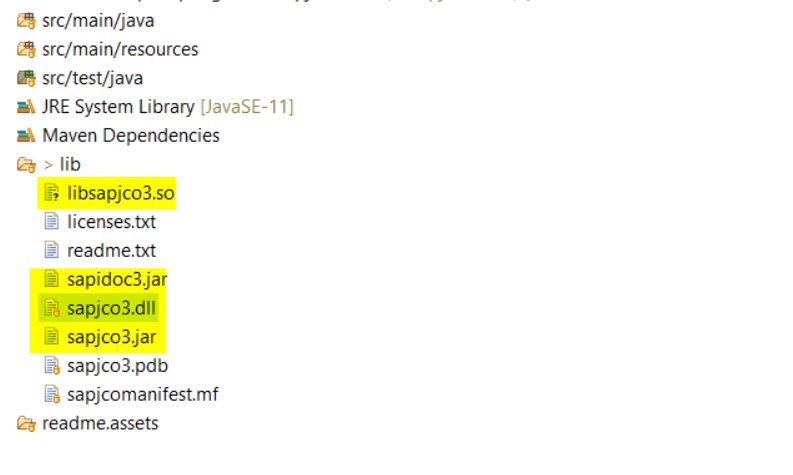
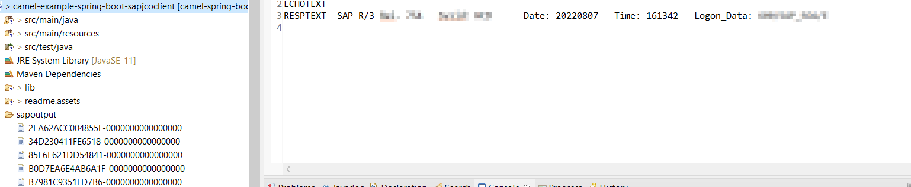

# Integrate Sap JCOClient with Springboot and Apache Camel 

### The usecase

Camel Timer-> SAP ABAP RFC call(via Camel Processor) ->  FileSystem

I wrote a  SpringBoot+Apachecamel Application to demonstrate how to call SAP's ABAP function' and store the result at file system.

### prepare  sap jco connector libs

copy jco jars, .dll (for windows), and .so(for linux) files to lib directory as below shown


 

### run apache camel springboot application 

- For linux

```
export ASHOST=<jco client ashost>
export GWHOST=<jco server gwhost>
```
- For windows

```
set ASHOST=<jco client ashost>
set GWHOST=<jco server gwhost>
```

run test
```
mvn -Dtest=sample.camel.SampleJCOClientApplicationTests   test
```
run program
```
mvn spring-boot:run 
```
### check result and output 

You will see ABAP function's result at console and it will also be stored at file directory sapoutput


