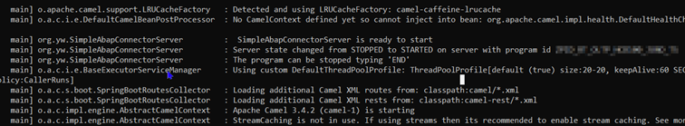
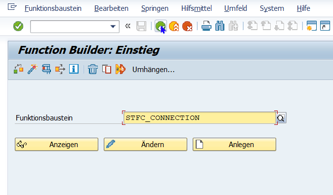
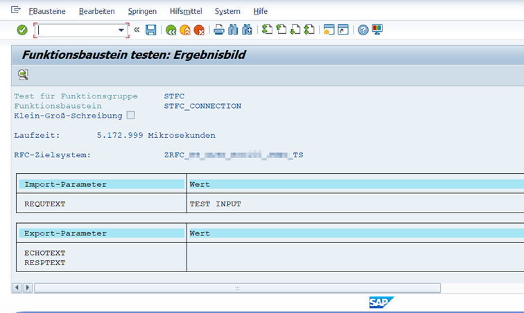
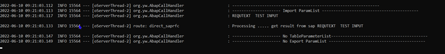
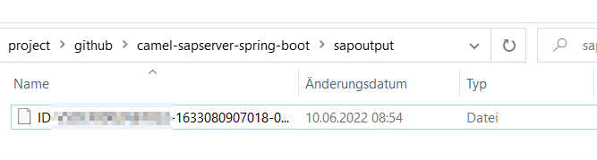

# integrate sap JCOServer with Springboot and Apache Camel 

### The usecase

SAP ABAP RFC call -> SpringBoot+ApacheCamel -> FileSystem

I wrote a  springboot+Apachecamel Application to demonstrate how to receive the ABAP function's result and store it at file system.

### run apache camel springboot application 

```
mvn spring-boot:run 
```



### execute ABAP function in SAP System
```
Execute Tcode se37 -> STFC_CONNECTION (SAP Test Function) 
```


put RFC Target System (it is ...not... as same as progid configured in application.yaml file) and input parameter


### check result and output 

You will see ABAP function's result at console 


The result of ABAP function is also stored as file by camel in your local computer where your java program runs 
