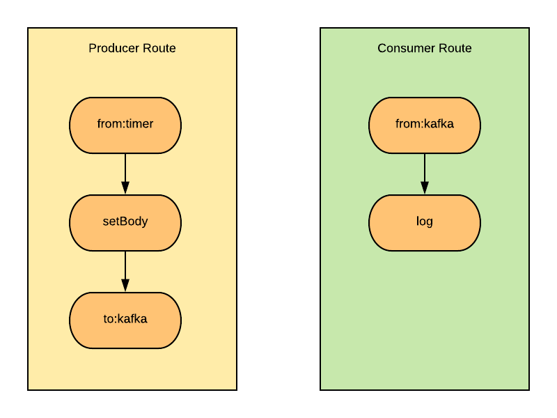

== Camel Strimzi Example

=== Introduction

This example shows how to integrate Camel with Strimzi: Kafka on Kubernetes/OpenShift.

We will have two routes basically. One for producing messages to Kafka cluster which we will setup via Strimzi and other one is for consuming messages which will consume messages from the Kafka cluster. Here is a very high-level diagram of the routes we will run shortly:

=== Preparing Strimzi Cluster

Login your Kubernetes/OpenShift cluster as cluster admin. For installing Strimzi operator you have to be a cluster admin.

After logging into your cluster create a namespace called `camel-example-strimzi`:

[source, shell]
----
kubectl create namespace camel-example-strimzi
----

Or for OpenShift create a project:

[source, shell]
----
oc new-project camel-example-strimzi
----

Next apply the Strimzi install files, including ClusterRoles, ClusterRoleBindings and some Custom Resource Definitions (CRDs). The CRDs define the schemas used for declarative management of the Kafka cluster, Kafka topics and users:

[source, shell]
----
curl -L https://github.com/strimzi/strimzi-kafka-operator/releases/download/0.16.2/strimzi-cluster-operator-0.16.2.yaml \
  | sed 's/namespace: .*/namespace: camel-example-strimzi/' \
  | kubectl apply -f - -n camel-example-strimzi 
----

For OpenShift:

[source, shell]
----
curl -L https://github.com/strimzi/strimzi-kafka-operator/releases/download/0.16.2/strimzi-cluster-operator-0.16.2.yaml \
  | sed 's/namespace: .*/namespace: camel-example-strimzi/' \
  | oc apply -f - -n camel-example-strimzi 
----

Now we are ready to create a Kafka cluster. We will create an ephemeral Kafka cluster with 3 brokers and 3 zookeeper nodes:

[source, shell]
----
kubectl apply -f src/main/resources/kafka-ephemeral-kubernetes.yaml -n camel-example-strimzi 
----

For OpenShift:

[source, shell]
----
oc apply -f src/main/resources/kafka-ephemeral-openshift.yaml -n camel-example-strimzi 
----

Wait while Kubernetes/OpenShift starts the required pods, services and so on:

[source, shell]
----
kubectl wait kafka/my-cluster --for=condition=Ready --timeout=300s -n camel-example-strimzi 
----

For OpenShift:

[source, shell]
----
oc wait kafka/my-cluster --for=condition=Ready --timeout=300s -n camel-example-strimzi 
----

Check the pods after the cluster is ready:

[source, shell]
----
kubectl get pods
----

For OpenShift:

[source, shell]
----
oc get pods
----

You should see the Kafka broker and zookeeper nodes as Ready:

[source, shell]
----
NAME                                          READY     STATUS    RESTARTS   AGE
my-cluster-entity-operator-576b867465-z6wxz   3/3       Running   0          2m11s
my-cluster-kafka-0                            2/2       Running   0          2m54s
my-cluster-kafka-1                            2/2       Running   0          2m54s
my-cluster-kafka-2                            2/2       Running   0          2m54s
my-cluster-zookeeper-0                        2/2       Running   0          5m7s
my-cluster-zookeeper-1                        2/2       Running   0          5m7s
my-cluster-zookeeper-2                        2/2       Running   0          5m7s
strimzi-cluster-operator-75c697fff6-hfsr8     1/1       Running   0          6m59s
----

Since the cluster is ready lets deploy our Camel application to Kubernetes/OpenShift.

=== Run Camel Application on Kubernetes/OpenShift

Before deploying the example application on Kubernetes/OpenShift we have to run `prepare-truststore.sh` since our Strimzi cluster uses SSL/TLS for external access. 

[IMPORTANT]
====
Because we will use the same route configuration for both internal and external access to Strimzi cluster, we have to create the truststore as well for the case we deploy our Camel application to Kubernetes/OpenShift.
====

[source,shell]
----
chmod +x prepare-truststore.sh && ./prepare-truststore.sh
----

This script will create a truststore.jks in your local application root path, and a configmap with the same file included for Kubernetes/OpenShift deployment.

Now we can deploy the Camel application on Kubernetes/OpenShift run k8s:deploy maven command for platform kubernetes:

[source,shell]
----
mvn k8s:deploy -Pkubernetes
----

Check the application is built, deployed and run properly:

[source,shell]
----
kubectl get pods -w
----

For OpenShift:

[source,shell]
----
oc get pods -w
----

When the application pod state is ready first check that there is a topic created with the name `TestLog` which is auto-created in the Kafka cluster. To get the topics created we can use custom resources of Strimzi:

[source,shell]
----
kubectl get kafkatopics
----

For OpenShift:

[source,shell]
----
oc get kafkatopics
----

You should see a topic list like this:

[source,shell]
----
NAME      PARTITIONS   REPLICATION FACTOR
testlog   1            1
----

[NOTE]
====
Since the `TestLog` topic is auto-created, it used Kafka cluster's default configuration for partition count and replication factor. Because this is an example, we will not change this.
====

Now lets check the logs of the Camel application and see if it consumes the messages properly:

[source,shell]
----
kubectl logs -f $(kubectl get pods -l app=camel-example-spring-boot-strimzi --output=jsonpath={.items..metadata.name})
----

For OpenShift:

[source,shell]
----
oc logs -f $(oc get pods -l app=camel-example-spring-boot-strimzi --output=jsonpath={.items..metadata.name})
----

You should see logs like this:

[source,shell]
----
12:16:02.377 [Camel (camel) thread #1 - KafkaConsumer[testlog]] INFO  Consumer Route - Hi, this is Camel-Strimzi example from kubernetes environment
12:16:03.130 [Camel (camel) thread #1 - KafkaConsumer[testlog]] INFO  Consumer Route - Hi, this is Camel-Strimzi example from kubernetes environment
12:16:04.182 [Camel (camel) thread #1 - KafkaConsumer[testlog]] INFO  Consumer Route - Hi, this is Camel-Strimzi example from kubernetes environment
12:16:05.553 [Camel (camel) thread #1 - KafkaConsumer[testlog]] INFO  Consumer Route - Hi, this is Camel-Strimzi example from kubernetes environment
12:16:06.170 [Camel (camel) thread #1 - KafkaConsumer[testlog]] INFO  Consumer Route - Hi, this is Camel-Strimzi example from kubernetes environment
12:16:08.057 [Camel (camel) thread #1 - KafkaConsumer[testlog]] INFO  Consumer Route - Hi, this is Camel-Strimzi example from kubernetes environment
12:16:09.739 [Camel (camel) thread #1 - KafkaConsumer[testlog]] INFO  Consumer Route - Hi, this is Camel-Strimzi example from kubernetes environment
12:16:10.156 [Camel (camel) thread #1 - KafkaConsumer[testlog]] INFO  Consumer Route - Hi, this is Camel-Strimzi example from kubernetes environment
12:16:10.157 [Camel (camel) thread #1 - KafkaConsumer[testlog]] INFO  Consumer Route - Hi, this is Camel-Strimzi example from kubernetes environment
12:16:11.255 [Camel (camel) thread #1 - KafkaConsumer[testlog]] INFO  Consumer Route - Hi, this is Camel-Strimzi example from kubernetes environment
----

You can see the Camel Consumer Route consumes the message  and prints it in the log in Kubernetes/OpenShift environment.

==== Run Camel Application Locally (Optional)

[WARNING]
====
This part of the example is only shown on OpenShift because there are different configurations for external access on Kubernetes -via Ingress- and OpenShift -via Routes- which is much easier to demonstrate. You can always setup a Kubernetes Ingress and configure in your Strimzi Kafka cluster resource regarding to this configuration.
====

Only thing you have to do is to change the `camel.component.kafka.brokers` to Route URL of the service that is provided by Strimzi cluster. You can do it either manually or with using `sed` command in a linux environment:

[source,shell]
----
sed -i 's/KAFKA_BOOTSTRAP_ROUTE_URL/'$(oc get route my-cluster-kafka-bootstrap --output=jsonpath={.spec.host})':443/g' src/main/resources/application-local.properties 
----

For Mac:

[source,shell]
----
sed -i '' 's/KAFKA_BOOTSTRAP_ROUTE_URL/'$(oc get route my-cluster-kafka-bootstrap --output=jsonpath={.spec.host})':443/g' src/main/resources/application-local.properties 
----

Once you changed the `kafka.bootstrap.url` you can run the application via maven -with using `local` profile:

[TIP]
====
It is optional to scale down the current Camel-Strimzi example application that's already running on OpenShift for consuming the logs that are produced only from local environment.

[source,shell]
----
oc scale dc/camel-example-spring-boot-strimzi --replicas=0
----
====

[source,shell]
----
SPRING_PROFILES_ACTIVE=local

mvn spring-boot:run
----

After application running you should see logs like this:

[source,shell]
----
15:16:02.377 [Camel (camel) thread #1 - KafkaConsumer[testlog]] INFO  Consumer Route - Hi, this is Camel-Strimzi example from local environment
15:16:03.130 [Camel (camel) thread #1 - KafkaConsumer[testlog]] INFO  Consumer Route - Hi, this is Camel-Strimzi example from local environment
15:16:04.182 [Camel (camel) thread #1 - KafkaConsumer[testlog]] INFO  Consumer Route - Hi, this is Camel-Strimzi example from local environment
15:16:05.553 [Camel (camel) thread #1 - KafkaConsumer[testlog]] INFO  Consumer Route - Hi, this is Camel-Strimzi example from local environment
15:16:06.170 [Camel (camel) thread #1 - KafkaConsumer[testlog]] INFO  Consumer Route - Hi, this is Camel-Strimzi example from local environment
15:16:08.057 [Camel (camel) thread #1 - KafkaConsumer[testlog]] INFO  Consumer Route - Hi, this is Camel-Strimzi example from local environment
15:16:09.739 [Camel (camel) thread #1 - KafkaConsumer[testlog]] INFO  Consumer Route - Hi, this is Camel-Strimzi example from local environment
15:16:10.156 [Camel (camel) thread #1 - KafkaConsumer[testlog]] INFO  Consumer Route - Hi, this is Camel-Strimzi example from local environment
15:16:10.157 [Camel (camel) thread #1 - KafkaConsumer[testlog]] INFO  Consumer Route - Hi, this is Camel-Strimzi example from local environment
15:16:11.255 [Camel (camel) thread #1 - KafkaConsumer[testlog]] INFO  Consumer Route - Hi, this is Camel-Strimzi example from local environment
----

Congratulations! You have just consumed and produced messages via Apache Camel routes, through Strimzi's Apache Kafka cluster.

=== Help & Contributions

If you hit any problem using Camel or have some feedback, 
then please https://camel.apache.org/community/support/[let us know].

We also love contributors, 
so https://camel.apache.org/community/contributing/[get involved] :-)

The Camel riders!

